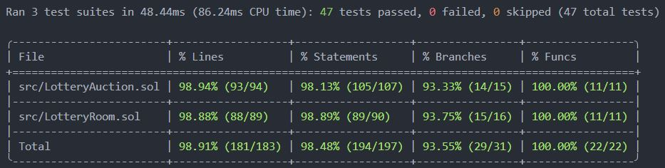

# Lottery Auction

A decentralized lottery with multiple independent rooms, built with Solidity and Foundry. Players enter a room with a fixed fee, Chainlink VRF randomly selects half of the auction participants, and a weighted random draw selects the final winner.

## Features

- Create, join, and leave multiple lottery rooms running independently
- Fixed entry fee and configurable room interval
- Chainlink Automation-compatible upkeep
- Chainlink VRF v2.5 randomness
- Auction stage with weighted bets
- Automatic local VRF subscription creation and funding
- Local Anvil deployment and deployment to supported public EVM networks.
- Unit and functional tests

## Requirements

- [Foundry](https://getfoundry.sh/)
- Git

## Setup

```bash
git clone --recurse-submodules https://github.com/GVatilin/lottery-auction.git
cd lottery-auction
make build
```

## Tests

Run the complete test suite:

```bash
make test
```

Run with detailed traces:

```bash
make test -vvvv
```

Test coverage:



## Local deployment

Start a local node:

```bash
make anvil
```

Deploy in another terminal:

```bash
make deploy-anvil
```

The local configuration deploys a VRF coordinator mock, creates and funds a subscription, deploys the lottery contract, and registers it as a consumer.

## Contracts

- `LotteryRoom.sol` manages rooms, players, entry fees, and exits.
- `LotteryAuction.sol` handles Automation, VRF requests, auctions, winner selection, and withdrawals.